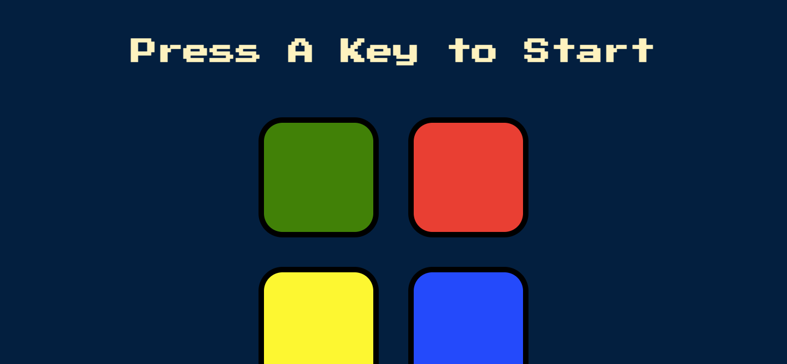

# The Simon Game
This is a solution to the Simon Game built with HTML, CSS, JavaScript, JQuery.


## Table of contents

- [Overview](#overview)
  - [The challenge](#the-challenge)
  - [Instructions](#GamePlay-instructions)
  - [Screenshot](#screenshot)
  - [Links](#links)
- [My process](#my-process)
  - [Built with](#built-with)
  - [What I learned](#what-i-learned)
- [Author](#author)


## Overview
The Simon game is the exciting electronic game of lights and sounds in which players must repeat random sequences of lights by pressing the colored pads in the correct order. It's fast-paced play, with lights and sounds that can challenge you. Experience the fun as you repeat the patterns and advance to higher levels.

### The challenge

Users should be able to:

- View the optimal layout for the site depending on their device's screen size.
- Generate random patterns and display to user with annimation of buttons and sounds.
  - Check for button pressed by user.
  - check random sequence against button pressed by user.
  - if true, move to highly level
  - if false, play error sound, display game-over.
    - Request user to press a key to restart game.  

### GamePlay-instructions
- Classic Simon gameplay
  - Press a key to start game 
  - Follow lights and sounds
  - Press the right buttons in sequence as displayed  
- Suspense builds as sequences get longer 
- Play solo
- For ages 8 and up 


### Screenshot




### Links

- Repository URL: [Add solution URL here](https://your-solution-url.com)
- Live Site URL: [Add live site URL here](https://your-live-site-url.com)

## My process

### Built with

- HTML5
- CSS
- Desktop-first workflow
- JavaScript
- JQuery


### What I learned
In Jquery Syntax for event listeners are different. However, it is much more straight forward as compared to vanilla javascript.

```js
// Game start
$(document).keypress(function () {
  if (!started) {
    nextSequence();
    started = true;
  }
});
```
Creating a start and restart function is a new set of codes I had to learn. This is my first time of actually making use of boolean data-type in my codes.

```js
// Game Restart function
function startOver() {
  level = 0;
  posIndex = 0;
  gamePattern = [];
  started = false;
}
```
fadeIn/fadeOut methods in JQuery makes it easy to create animations. I used the code below to animate buttons in sequence to the user.

```js
  setTimeout(() => {
    $("#" + randomChosenColor)
      .fadeIn(100).fadeOut(100).fadeIn(100);
    makeSound(randomChosenColor);
  }, 2900);
```

## Author

- Website - [Augustine Aryeteh Asare](https://github.com/AustinKing5)
- Frontend Mentor - [@@AustinKing5](https://www.frontendmentor.io/profile/AustinKing5)
- Twitter - [@aryetehasare](https://www.twitter.com/aryetehasare)

